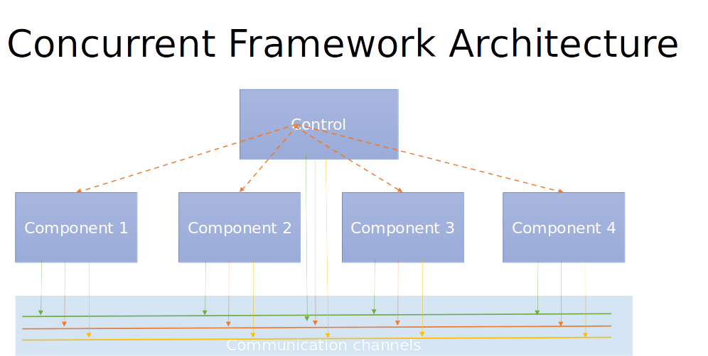

## concurrent-framework-Product-Solutions

##### Product Solution Design (learning )

Let us design and build a concurrent framework to baseline for new product development. 

Then, one by one new functionalities will be added using this framework. Altogether, the new product will be ready. 

Based on my understanding, the steps need to be followed to give product solutions using the concurrent framework.

Step1: Business idea 

Step2: Collect functionalities

Step3: Block diagram representation of functional components

Step4: Map functionalities to components

Step5: Modeling & Storage

Step6: Communication and Networking

Step7: Security

Step8: Concurrent Architecture

Step9: Fit component to concurrent architecture

Step10: Add additional functional component

